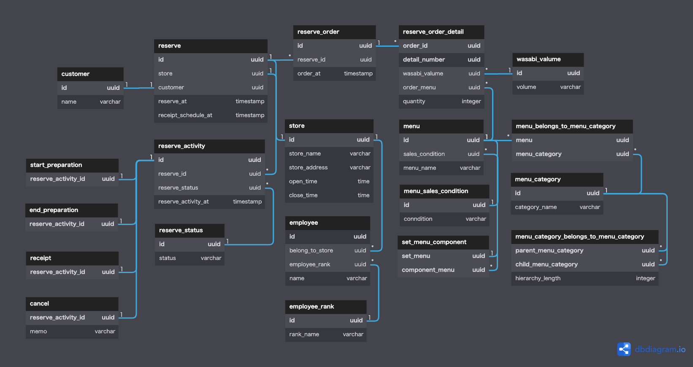

# DBモデリング１(注文管理システム)

<br>

## 前提
- サービスの内容としては、全国チェーン寿司店の持ち帰り用予約サービスを想定する
  - くら寿司アプリの「スマホで持ち帰り」機能のイメージ
- 寿司屋の従業員には管理者と店舗スタッフがいる
- 席の予約機能/スマホでの注文機能/会計機能はない
- 商品には単品寿司メニューとセットメニューがある
- セットメニューは複数の単品寿司メニューや複数のセットメニューから構成される
- 予約に関する情報(受け取り店舗や日時)は変更不可とする

<br>

## ユースケース
- 顧客が会員登録する
- 顧客が予約可能な店舗を検索/指定する
- 顧客が受け取り可能な日時を検索/指定する
- 顧客がカテゴリ毎に商品を閲覧する
- 顧客が商品を注文リストに加える
  - 商品数を選択する
  - サビの有無を選択する
- 顧客が注文リストの予約を確定する
- 顧客が予約を確認する
- 顧客が予約した注文リストを変更する
- 顧客が予約を取り消す
- 店舗スタッフが商品カテゴリを新規登録/更新する
- 店舗スタッフが商品カテゴリの親子関係を更新する
- 店舗スタッフが商品を新規登録/更新する
  - 単品寿司メニューを新規登録/更新する
  - セットメニューを新規登録/更新する
  - 商品名/商品カテゴリ/サビの指定可否/販売状況を設定する
    - １商品に１つ以上の商品カテゴリを設定する
    - 販売状況は、提供可能/品切れ/販売中止から選択する
- 店舗スタッフが商品を検索する
- 店舗スタッフが予約注文を確認する
- 店舗スタッフが予約注文のステータスを更新する
  - 準備中/受け取り可能/受け取り済み/キャンセル
- 管理者が店舗を新規登録/更新する
- 管理者が店舗スタッフの新規登録/更新する
- 管理者が店舗毎の予約データを分析する

<br>

## エンティティ

### イベント系
- 予約
  - 予約注文
    - 予約注文詳細
  - 予約アクティビティ
    - 準備開始
    - 準備完了
    - 引渡し
    - 予約取消
予約アクティビティについて
予約のステータスは「未着手/準備中/提供可能/引渡済み/予約取消」が考えられる。
各ステータス間のイベントに紐づく情報が日時情報くらいしかなさそうだが、
一応ロングタームイベントパターンを採用しておく(セッションで話したい)。
イベントに切り出す理由としては、例えば、
「受け取り予定時間の10分前までに予約ステータスが(準備開始)になっていなければアラートを出す」
といった追加機能に対応できるようにするため。

### リソース系
- 店舗
- 従業員
- 顧客
- 商品
- セットメニュー構成
- 商品カテゴリ
- 商品カテゴリ所属カテゴリ
- 商品の商品カテゴリ
- サビ設定
- 商品の販売状況
- 予約ステータス

<br>

## モデリング図

[DBdiagramリンク](https://dbdiagram.io/d/6306d4f1f1a9b01b0fdada0a)

<br>

## 複雑そうなSQL

```SQL
-- あるユーザの予約に紐づく最新の注文リストの取得
SELECT
  *
FROM
  reserve
  INNER JOIN 
    reserve_order AS latest_order
    ON  reserve.id = latest_order.reserve_id
    AND latest_order.order_at = (SELECT MAX(order_at) AS latest FROM reserve_order GROUP BY reserve_id)
  INNER JOIN
    reserve_order_detail AS order_detail
    ON latest_order.id = order_detail.order_id
WHERE
  reserve.customer = 'f6a16ff7-4a31-11eb-be7b-8344edc8f36b'
;

-- 現在の予約内で特定のステータスの一覧を取得
SELECT
  *
FROM
  reserve
  INNER JOIN
    reserve_activity AS activity
    ON reserve.id = activity.reserve_id
    AND reserve_activity_at = (SELECT MAX(reserve_activity_at) AS latest FROM reserve_activity GROUP BY reserve_id)
WHERE
  activity.reserve_status = 'f6a16ff7-4a31-11eb-be7b-8344edc8f36b'
;

```

## 参考記事
- [イミュータブルデータモデル](https://scrapbox.io/kawasima/%E3%82%A4%E3%83%9F%E3%83%A5%E3%83%BC%E3%82%BF%E3%83%96%E3%83%AB%E3%83%87%E3%83%BC%E3%82%BF%E3%83%A2%E3%83%87%E3%83%AB)
