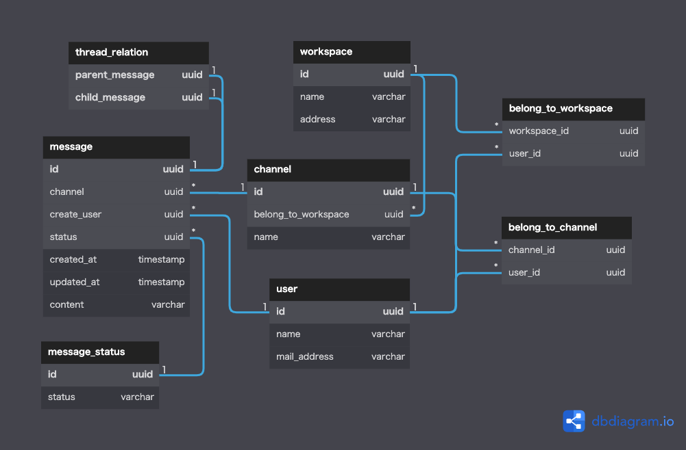

# DBモデリング2(チャットシステム)

<br>

## 前提
- メッセージとスレッドメッセージは「親メッセージの有無」以外は同じ情報を持つと考えられるため、同一テーブルで扱う
- ワークスペースやチャネルの作成イベントは考慮しない

<br>

## ユースケース
- ユーザがワークスペースに参加する
- ユーザがワークスペースから脱退する
- ユーザがチャネルに参加する
- ユーザがチャネルから脱退する
- ユーザがメッセージを作成する
- ユーザがメッセージを更新する
- ユーザがメッセージに削除する
- ユーザがスレッドメッセージを作成する
- ユーザがスレッドメッセージを更新する
- ユーザがスレッドメッセージを削除する
- ユーザが参加しているチャネルの範囲内でメッセージ・スレッドメッセージを検索する
- ユーザがメッセージを閲覧する
- ユーザがメッセージを開いて紐づくスレッドメッセージを閲覧する

<br>

## エンティティ

#### イベント系
- メッセージ/スレッドメッセージ登録
- スレッド関係

#### リソース系
- ユーザ
- ワークスペース
- チャネル
- ワークスペース_ユーザ
- チャネル_ユーザ

<br>

## モデリング図

[DBdiagramリンク](https://dbdiagram.io/d/630d6d800911f91ba5f0175f)

<br>

## テーブルの仕様

### message
- `message`に`channel`カラムを追加した理由
  - `channel`から退出したユーザのメッセージを表示するため
  - 検索時のパフォーマンスを考慮
- メッセージの削除はステータスで表現する
  - 実際のslackでは、メッセージを削除しても紐づくスレッドメッセージは残り、関係性も維持される
  それを実現するためにmessageテーブルから物理削除しない
#### thread_relation
- メッセージもスレッドメッセージも`message`テーブルに登録する
- スレッドメッセージを登録するときは`thread_relation`で親子関係を示す
- メッセージを登録したときは`thread_relation`の親子ともに自身のメッセージidを示す(親レコード抽出を簡単にするため)
#### belong_to_workspace/belong_to_channel
- 参加したらレコードを登録する。脱退したら物理削除する
#### user
- slackではユーザアカウント自体を削除するユースケースが無いようなのでinsertのみ考える
  - もしユーザアカウントを削除するユースケースが生まれたらどうするか。いい方法が思い浮かばない

<br>

## SQLが複雑そうなケース

```SQL
-- ユーザが参加しているチャネル内のメッセージを検索する
SELECT
  *
FROM
  message
WHERE
  message.status = 'f6a16ff7-4a31-11eb-be7b-8344edc8f36b' -- message_status_id
  AND message.channel = (SELECT channel_id FROM belong_to_channel WHERE user_id = 'f6a16ff7-4a31-11eb-be7b-8344edc8f36b') -- user_id
;


-- あるチャネル内の有効な親メッセージを作成時間順に取得
SELECT
  *
FROM
  message
  INNER JOIN
    thread_relation AS thread
    ON message.id = thread.parent_message
    AND message.id = thread.child_message
WHERE
  message.channel = 'f6a16ff7-4a31-11eb-be7b-8344edc8f36b' -- channel_id
  AND status = 'f6a16ff7-4a31-11eb-be7b-8344edc8f36b' -- message_status_id
ORDER BY
  created_at DESC
;

-- あるチャネル内の特定の親メッセージに紐づくスレッドメッセージを作成時間順に取得
SELECT
  *
FROM
  message
  INNER JOIN
    thread_relation AS thread
    ON thread.parent_message = 'f6a16ff7-4a31-11eb-be7b-8344edc8f36b' -- message_id
WHERE
  message.channel = 'f6a16ff7-4a31-11eb-be7b-8344edc8f36b' -- channel_id
  AND status = 'f6a16ff7-4a31-11eb-be7b-8344edc8f36b' -- message_status_id
ORDER BY
  created_at DESC
;

```

<br>

## 残課題・疑問
- 参加/脱退をイベントとして残すかどうか
  - 参加や脱退のイベントテーブルを作ったとしても日時情報以外の値は他に無さそう
  - 「いつ参加や脱退をしたか」は業務上それほど重要ではない
- 以下の仕様をどうやってモデリングで表現するか
  - スレッドメッセージが紐づくメッセージを削除しても、「削除されました」とTL上に表示されてスレッドメッセージは閲覧できる
  - スレッドメッセージを削除すると完全に削除される

<br>

## 参考記事
- [イミュータブルデータモデル](https://scrapbox.io/kawasima/%E3%82%A4%E3%83%9F%E3%83%A5%E3%83%BC%E3%82%BF%E3%83%96%E3%83%AB%E3%83%87%E3%83%BC%E3%82%BF%E3%83%A2%E3%83%87%E3%83%AB)
- [ユーザ情報を保存する時のテーブル設計](https://soudai.hatenablog.com/entry/2018/05/01/204442)
- [Slackで自分のアカウント情報を完全に削除する方法](https://best-cloud.jp/slack-delete-account/)
- [Tables for Slack Clone](https://hasura.io/learn/graphql/hasura-auth-slack/data-modeling/1-tables/)
- 
