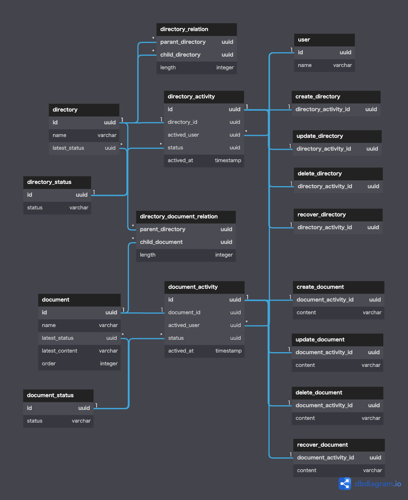

# DBモデリング3(ドキュメント管理システム)

<br>

## 前提
- ルートディレクトリはあらかじめ登録されているものとする

<br>

## ユースケース
- ユーザがディレクトリを作成する
- ユーザがディレクトリを更新する
- ユーザがディレクトリを削除する
  - ユーザが削除したディレクトリを復元する
- ユーザがディレクトリを閲覧する
- ユーザがディレクトリを別のディレクトリ配下に移動する
- ユーザがドキュメントを作成する
- ユーザがドキュメントを更新する
- ユーザがドキュメントを削除する
  - ユーザが削除したドキュメントを復元する
- ユーザがドキュメントへの操作履歴を閲覧する
- ユーザがドキュメントを閲覧する
- ユーザがドキュメントの順番を変更する
- ユーザがドキュメントを別のディレクトリ配下に移動する


<br>

## エンティティ
#### イベント系
- ディレクトリアクティビティ
  - 登録
  - 更新
  - 削除
  - 復元
- ドキュメントアクティビティ
  - 登録
  - 更新
  - 削除
  - 復元
#### リソース系
- ユーザ
- ディレクトリ
- ディレクトリステータス
- ドキュメント
- ドキュメントステータス
- ディレクトリ_ディレクトリ関係
- ディレクトリ_ドキュメント関係
<br>

## モデリング図

[DBdiagramリンク](https://dbdiagram.io/d/62f353d7c2d9cf52fa7c382d)

<br>

## テーブルの仕様

### document
- `name`はドキュメント名。今回は履歴を管理するほど重要ではないと仮定し、変更した場合はupdateする
  - もし`name`も履歴管理するなら、`content`と`name`ごとにイベントテーブルを作成する
- `order`は配下ディレクトリ内でのドキュメントの並び順。変更時はどう階層のドキュメントを一斉更新する
  - 例えばディレクトリ内にドキュメントA、ドキュメントB、ドキュメントC順に並んでいたらA:1、B:2、C:3
  C、A、Bに並び替えたらA:2、B:3、C:1に更新する。フロント側で並び替えたをした際のイベントを検知し、現在の順番で更新リクエストを送信するイメージ

### directory_relation / directory_document_relation
- 親ディレクトリを`parent_directory`に、子を`child~`に登録する
- すべての階層分の親子関係を記録する
  - 例えば ディレクトリA > ディレクトリB > ディレクトリC という階層構造の場合
  Cの親としてAとBの両方の関係のレコードを登録する
    - Aを親にしたレコードの`length`は、Aから見たときのCは２階層目なので2を登録する
  - また、取得をシンプルにするために親と子に自身のディレクトリを持つ関係レコードも登録する

### directory_activity / document_activity
- ディレクトリ/ドキュメントのアクティビティのスーパータイプ。いつ/誰が/どんな操作したかを管理

<br>

## SQLが複雑そうなケース

```SQL

-- あるディレクトリ配下のドキュメントをorder順に取得
SELECT
  document.name
  ,document.latest_content
  ,document.order
FROM
  document
  INNER JOIN
    directory_document_relation AS relation
    ON  relation.parent_directory = '32ab497d-662d-48fb-8951-a4232f5bb458' -- 指定したディレクトリID
    AND document.id = relation.child_document
    AND relation.length = 1 -- １階層目
WHERE
  document.latest_status <> '1b57da24-7e6c-4f0c-9939-ee03436744b5' -- deleted
ORDER BY
  document.order ASC
;


-- ドキュメントを別のディレクトリ１からディレクトリ２に移動させる
-- ①ドキュメントを子に持つすべてのdirectory_document_relationを削除する
DELETE FROM 
  directory_document_relation AS relation
WHERE
  relation.child_document = ''

-- ②ディレクトリ２を子に持つすべての関係をdirectory_relationから取得する
SELECT
  relation.parent_directory,
  relation.child_directory,
  relation.length
FROM
  directory_relation AS relation
WHERE
  relation.child_directory = '' -- ディレクトリ2のID

-- ③②で取得したparent_directoryを流用してdirectory_document_relationを登録する。
-- ②で取得したlengthは各親ディレクトリから見たディレクトリ２に対してのlengthなので、length+1がドキュメントのlengthになる
INSERT INTO directory_document_relation VALUES (
  ②で取得したparent_directoryのID, 
  ドキュメントのID, 
  ②で取得したlength+1
)
```

<br>

## 残課題・疑問
- 階層構造が深くなったときのディレクトリの構造を変更するSQLがかなり大変そうで作れていない。
  - 特に、削除されたディレクトリの親ディレクトリを別のディレクトリに移動した後で、削除したディレクトリを復元するなどのパターン

<br>

## 参考記事
- [イミュータブルデータモデルと webアプリケーションにおける現実解](https://qiita.com/urakawa/items/3d7777e6734cb5c15bd1)
- [The Basics Of PostgreSQL UUID Data Type](https://www.postgresqltutorial.com/postgresql-tutorial/postgresql-uuid/)
