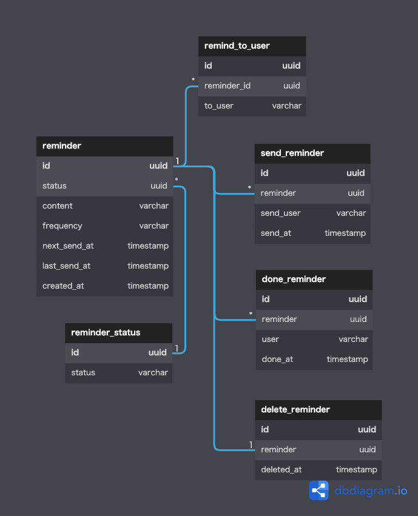

# DBモデリング4(リマインドシステム)

 

## 前提
- バッチは「次回の送信時間が現在時刻以前であればリマインドするバッチ」と「リマインダーの次回の送信時間を計算するバッチ」の2種類あるものとする
  - １時間に１度、前者のバッチを起動し、それから後者のバッチを起動する
- slackにアクセスして取得できるデータ(ユーザデータ等)はDB管理しないものとする

 

## ユースケース
- ユーザAが周期を定めたリマインダーをユーザBに対して登録する
  - 設定可能な周期
    - 毎日
    - X日おき
    - 毎週X曜日
    - 毎月X日
- ユーザBにリマインダーが送信される
- ユーザBがタスクを完了する

 

## エンティティ
#### イベント系
- リマインド送信
- リマインド完了
- リマインド削除

#### リソース系
- リマインド
- リマインド相手
- リマインドステータス

 

## モデリング図

[DBdiagramリンク](https://dbdiagram.io/d/6310260c0911f91ba50e9c50)

 

## テーブルの仕様

### reminder
- `frequency`にはcron形式で頻度を登録しておく。「リマインダーの次回の送信時間を計算するバッチ」は`frequency`と`last_send_at`から求めた時刻で`next_send_at`を更新する
- `status`は「有効/完了/削除」
  - 「完了」はリマインド対象ユーザ全員がタスク完了したら登録する
### reminde_to_user
- リマインダーを送信するユーザを指定する
- タスクが完了したユーザのレコードは物理削除する
### done_reminder
- ユーザがタスクを完了したら、ユーザごとにレコードを登録する
