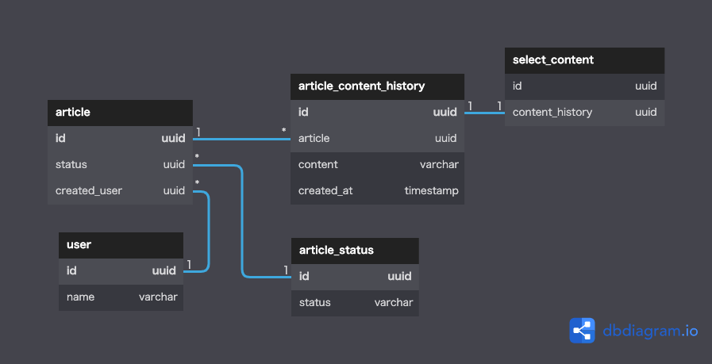

# DBモデリング5(履歴保存可能なブログサービス)

<br>

## 前提
- 作成・更新系のイベントは考慮せず、リソース系だけで表現している
  - 当初はイベント系で管理しようとしたが、`content_history`として一括で履歴を管理したいのに`create_content`と`update_content`があることで別々の管理になり、運用が複雑になると判断した


<br>

## ユースケース
- ユーザが記事を登録する
- ユーザが記事の一覧を表示する
- ユーザが記事の内容を確認する
- ユーザが記事を編集する
- ユーザが記事を削除する
- ユーザが記事の編集履歴を確認する
- ユーザが記事の編集履歴を選択し、現在の記事として登録する

<br>

## エンティティ
#### イベント系
- 履歴選択


#### リソース系
- ユーザ
- 記事
- 記事履歴
- 記事ステータス

<br>

## モデリング図

[DBdiagramリンク](https://dbdiagram.io/d/6315a0fc0911f91ba5360492)

<br>

## テーブルの仕様

### article_content_history/select_content
- 記事を更新するたびに、その時点での本文が蓄積されていく
- 記事作成時/更新時/過去記事選択時に`select_content`に対象の履歴IDを持たせる
  - `article`にキャッシュとして`current_content`を持たせようとしたが、履歴一覧のうちどれを選択しているのか判断できる方がいいと考えた

<br>

## SQLが複雑そうなケース
```SQL

-- 記事一覧を取得
SELECT
  *
FROM
  article
  INNER JOIN
    article_content_history AS history
    ON article.id = history.article
  INNER JOIN
    select_content AS selected
    ON history.id = selected.content_history
WHERE
  article.status <> '32ab497d-662d-48fb-8951-a4232f5bb458' -- 削除以外
  AND article.created_user = '32ab497d-662d-48fb-8951-a4232f5bb458' -- 指定ユーザ
;

```
