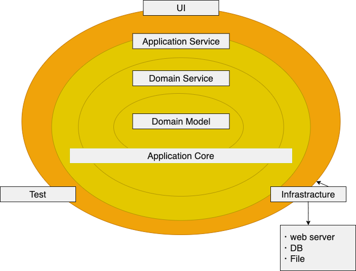

# オニオンアーキテクチャを学ぶ

## 課題 1

 

### オニオンアーキテクチャを図解

`オニオンアーキテクチャ図.png`

ドメインモデル
ビジネスロジックにおける各概念(ユーザ、商品、タスクなど)の値や振る舞いを保持する。
ドメインモデルに業務知識を集めることで、業務に関するルールがソースコード上に散在せずに済む。
エンティティや値オブジェクトなどが含まれる。
変更理由が「ビジネスロジックの変更」に限定されるように作る。

ドメインサービス
ドメインモデルだけでは実現できなかったり、ドメインモデルに実装すると違和感があるロジックを保持する。
ドメインモデルを組み合わせて利用することで実現するのが責務。
ドメインモデルと同じく変更理由が「ビジネスロジックの変更」に限定されるように作る。

アプリケーションサービス
ドメイン層やリポジトリのインターフェースを組み合わせて、
ユースケースを実現するのが責務。

UI 層
ユーザインフターフェースとアプリケーションサービスを結びつけを行うのが責務。
ユーザからのリクエストを適切な形に変換し、
リクエストとアプリケーションサービスが提供するユースケースとのルーティングを行う。
一般的にはコントローラーの役割を担う。

インフラ層
外部サービスと疎通するためのコードが置かれている場所。
リポジトリの実装クラスやインフラの設定ファイルなどを保持する。
ドメイン層のインターフェースに合わせて実装する(依存性逆転)

 

### ドメインモデル層がどの層にも依存しないことのメリット

ドメインモデル層にビジネスロジックが集約するため、ドメインモデル層を見るだけでビジネスロジックを理解できる。
ビジネスロジックの変更以外の理由でコードを修正する必要がない。
ドメインモデル層のテスタビリティが向上するため、バグを減らせる。

 

### 層を跨いで依存関係が発生するときにインターフェースに対する依存のみ許可することのメリット

インターフェースを介することで直接的な依存関係が生まれず、呼び出し元は呼び出し先の変更の影響を受けない。
例えばユースケース(アプリケーション)層がインフラ層に依存していた場合、
インフラ層が提供しているメソッドの仕様に依存しているため、ユースケース層を修正する必要がある。
インターフェースに依存していた場合はインフラ層を抽象化したメソッドに依存するため、
ユースケース層に修正は必要なく、インフラ層のみ修正すればいい。
つまり、高レイヤが低レイヤの変更による影響を受けなくなる。

 

### 「依存性の逆転」がオニオンアーキテクチャにおいてどう使われているか

伝統的なレイヤードアーキテクチャではドメイン層がインフラ層に依存している。
システムの核となるドメイン層が DB やクライアントの変更の影響を受けるのは大変なので、
依存性の逆転を利用して、ドメイン層からインフラ層への依存をインターフェースに留めている。

 

### 特定のユーザだけリソースの追加や更新できるアクセス制限機能を実装したい場合、どの層に記述するのが適切でしょうか？

以下の構成で、「商品追加権限判定クラス」に制限機能を実装する。
ドメインサービス層の商品追加クラスで、ユーザクラス、商品クラス、商品追加権限判定クラスを利用する。
ユーザインスタンスを商品追加権限判定クラスが受け取ることで追加可能かどうかを判定する。
「権限ごとのアクセス制限」に関する知識は膨大になりがちなので、
ユーザと切り離す必要があると考え、別クラスに切り出している。

前提

- 商品管理システム
- ユーザ：店長とアルバイト
  - 店長だけ商品の新規追加可能

ドメインモデル層

- 商品クラス
- ユーザクラス
- 商品リポジトリインターフェース

ドメインサービス層

- 商品追加権限判定クラス

アプリケーションサービス層

- 商品追加クラス

インフラ層

- 商品リポジトリクラス

プレゼンテーション層

- 商品コントローラー

 

### データベースを MySQL から PostgreSQL に変更するとします。どの層を変更する必要があるでしょうか？

インフラ層のみ

## オニオンアーキテクチャに関するクイズ

「ユーザの重複判定」ロジックを追加する場合、どのように実装しますか?
前提として、user エンティティは name と email を値オブジェクトとして保持し、
domain 層にあるとする。email の重複をユーザの重複とする。

## レビュー後のメモ

### オニオンアーキテクチャで「リポジトリや認可認証等をどの層に置くか」について。

外部サービスを使うにしろ自前で作るにしろ、何かの仕組みを導入するときは、その仕組みを使って実現したいビジネスロジックと、具体的な手段としてのシステム的な面がある。
ビジネスロジックはソフトウェア上重要度が高く実現手段を問わないので、ドメイン層にインターフェースとして置き、システム面は重要度が低く具体的な手段なので、外側の UI/インフラ層に実装として置く。
ここでいうビジネスロジックは、リポジトリだと「イベントの記録や参照」で
認証認可だと「誰が何をできるかの判定」を想定している。
認証認可のビジネスロジックは、実際の業務を考えると最初に行われる前提があったり、システム的な都合もあって、ドメイン層より上の層に置かれやすいのかなと思う。

## 参考記事 & メモ

> [実践 DDD 本 第 7 章「ドメインサービス」～複数の物を扱うビジネスルール～ (1/4)|CodeZine（コードジン）](https://codezine.jp/article/detail/10318)
> DDD 本におけるドメインサービスの解説
> 　ときには、単純に「物」とはできないこともある。……ドメインにおける重要なプロセスや変換処理が、エンティティや値オブジェクトの自然な責務ではない場合、その操作は、サービスとして宣言される独立したインターフェイスとしてモデルに追加すること。モデルの言語を用いてインターフェイスを定義し、操作名が必ずユビキタス言語の一部になるようにすること。サービスには状態を持たせないこと。

> [ボトムアップドメイン駆動設計 │ nrslib](https://nrslib.com/bottomup-ddd/#outline__6)
> ドメインサービスに記述するか迷ったとき
> ドメインサービスとエンティティのどちらにロジックを記述するか迷ったときはエンティティに記述してください。
> ドメインサービスと値オブジェクトのどちらにロジックを記述するか迷ったときは値オブジェクトに記述してください。
> ドメインサービスはエンティティや値オブジェクトに関する処理ではありますが、エンティティや値オブジェクトに実装するのが自然でない場合のみに扱います。

> [1 人開発のコードにオニオンアーキテクチャを導入した経験談 - Akatsuki Hackers Lab | 株式会社アカツキ（Akatsuki Inc.)](https://hackerslab.aktsk.jp/2020/12/16/214956)
>
> - 「内側のレイヤは外側のレイヤの変更の影響を受けない」と思っていましたが、そうでない場面もありました。パフォーマンスチューニングをするにあたって、例えば DB を使う場面で、複数レコードをまとめて INSERT することで DB との通信回数を減らすなど、ドメインが DB の事情に全く無関心というわけにはいきません。「内側で interface を定義して外側で実装する」というのは「外側の変更の影響を受けない」とはイコールではありませんでした。

> [なぜソフトウェアアーキテクチャを考えるか](https://zenn.dev/sterashima78/articles/e403fc0fe0e96a)
>
> - MVC がアプリケーションの機能に注目して問題を分割しているのに対して、オニオンアーキテクチャではアプリケーションに必要な問題領域に注目して問題を分割している。
> - 気をつけたいのは、細かく別れているからいいというわけではないという点だ。
>   はじめに記載したとおり、問題が細かく別れているということは各問題の関係性を適切に管理する必要があるからだ。

> [Onion Architecture. Let’s slice it like a Pro | by Ritesh Kapoor | Expedia Group Technology | Medium](https://medium.com/expedia-group-tech/onion-architecture-deed8a554423)
>
> - Whenever data crosses layers/boundaries, it should be in a form that is convenient for that layer. E.g. API’s can have DTO’s, DB layer can have Entity Objects depending on how objects stored in a database vary from the domain model.
> - The goal is to minimize coupling between layers and maximize coupling within a vertical slice across layers.
> - Business rules that belong to the domain model, domain services and application services should be tested via Unit Testing. As we move to the outer layer, it makes more sense to have integration tests in infrastructure services. For our application End to End testing and BDD are the most appropriate testing strategies.

> [構造的部分型 (structural subtyping) | TypeScript 入門『サバイバル TypeScript』](https://typescriptbook.jp/reference/values-types-variables/structural-subtyping)
>
> - 公称型(Nominal Typing)
>   Java, C++で採用されている定義です。
>   ある型を基本型にする派生型は、互いに置換ができません。
> - 構造的部分型(Structural Subtyping)
>   Go, TypeScript で採用されている定義です。
>   その型の見た目(シグネチャ)が等しければ置換可能であるという点が公称型と大きく異なっています。公称型ほど硬くはなく、とはいえ型の恩恵は受けたいというやや緩い型付けです。
>   [オブジェクト詰め替えが面倒臭い？マルチカーソルを使えば 10 秒でできます - little hands' lab](https://little-hands.hatenablog.com/entry/2021/09/27/multicursor)
> - オニオンアーキテクチャ、クリーンアーキテクチャなどの階層化されたアーキテクチャを使用する際、レイヤーの境界でオブジェクトの値を詰め替える必要性が発生します。 オブジェクトを詰め替えることでレイヤーの依存関係を断ち切り、一度書いた後の保守性を高めることに大きく貢献するのですが、筆者の観測範囲では単調作業に感じるせいかかなり嫌われる傾向があるように感じます。

> [DDD を意識した際の package 構成](https://zenn.dev/morio_pg/articles/16777261720294644011)
> DB から取得した値を直接 model や value に変換するとやりづらいことが多かった
> 変換用の DTO を用意してドメインオブジェクトへの変換を任せることで特に外部 API のレスポンスの形式などを意識しなくていい
> 各 DTO の名称は下記のように用途毎に分ける
> リクエスト関連：Form（Web）、Request（API）
> レスポンス関連（JSON）：Response、View
> DB や外部 API：Entity

- [クリーンアーキテクチャ完全に理解した](https://gist.github.com/mpppk/609d592f25cab9312654b39f1b357c60)
- [実践クリーンアーキテクチャ with Java │ nrslib](https://nrslib.com/clean-architecture-with-java/#outline__4)
- [[DDD]ドメイン駆動 + オニオンアーキテクチャ概略 - Qiita](https://qiita.com/little_hand_s/items/2040fba15d90b93fc124)
- [Domain 層とインフラ層の依存関係を逆転するためのオニオンアーキテクチャ - kidooom's Scrapbox](https://scrapbox.io/kidaaam-92022284/Domain%E5%B1%A4%E3%81%A8%E3%82%A4%E3%83%B3%E3%83%95%E3%83%A9%E5%B1%A4%E3%81%AE%E4%BE%9D%E5%AD%98%E9%96%A2%E4%BF%82%E3%82%92%E9%80%86%E8%BB%A2%E3%81%99%E3%82%8B%E3%81%9F%E3%82%81%E3%81%AE%E3%82%AA%E3%83%8B%E3%82%AA%E3%83%B3%E3%82%A2%E3%83%BC%E3%82%AD%E3%83%86%E3%82%AF%E3%83%81%E3%83%A3)
- [Melzar/onion-architecture-boilerplate: Node.js / Express Onion Architecture boilerplate with Typescript - OOP Variant](https://github.com/Melzar/onion-architecture-boilerplate)
- [実践！ Typescript で DDD - マイクロサービス設計のすすめ - Leverages Tech Blog](https://tech.leverages.jp/entry/2021/08/19/141229)
- [André Bazaglia - Clean architecture with TypeScript: DDD, Onion](https://bazaglia.com/clean-architecture-with-typescript-ddd-onion/)
- [node.js - This module is declared with using 'export =', and can only be used with a default import when using the 'esModuleInterop' flag - Stack Overflow](https://stackoverflow.com/questions/62273153/this-module-is-declared-with-using-export-and-can-only-be-used-with-a-defau)
- [Inversify を使った、型堅牢な DI コンテナの構築 - kotamat's site](https://kotamat.com/post/inversify/)
- [TypeScript の no initializer and is not definitely エラーの対処法 | iwb.jp](https://iwb.jp/typescript-properties-no-initializer-and-is-not-definitely-error/)
- [TypeScript: Koa で POST されたフォームの内容を取得する - Qiita](https://qiita.com/suin/items/542f59e1f9723368161d)
- [naoya on Twitter: "オニオンアーキテクチャで、層をまたいだところでデータを受け渡しするのに DTO を作って値を詰め替える、というあれはいったいなんであんなことになってしまったのかというのを、ぼんやり、いろいろなブログなどを読みながら考えていた" / Twitter](https://twitter.com/naoya_ito/status/1539391448881446912)
- [お前らが Model と呼ぶアレをなんと呼ぶべきか。近辺の用語(Entity とか VO とか DTO とか)について整理しつつ考える - Qiita](https://qiita.com/takasek/items/70ab5a61756ee620aee6)
- [DDD に関しての自分のメモ.md](https://gist.github.com/morio-pg/cab2fc4e9e01b3c398f389b64a1fc3be)
  [モデルでドメイン知識を表現するとは何か[DDD] - little hands' lab](https://little-hands.hatenablog.com/entry/2017/10/04/201201)
