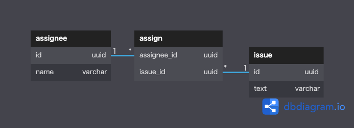

# データベースにおけるNULLの扱い

<br>

## 課題1

```sql
SELECT NULL = 0;  -- NULL
SELECT NULL = NULL; -- NULL
SELECT NULL <> NULL; -- NULL
SELECT NULL AND TRUE; -- NULL
SELECT NULL AND FALSE; -- FALSE
SELECT NULL OR TRUE; -- TRUE
SELECT NULL IS NULL; -- TRUE
SELECT NULL IS NOT NULL; -- FALSE
```
- NULLはTRUEでもFALSEでもなく「値が存在しない状態」
- 等式・不等式では評価できず、`IS`や`IS NOT`が必要
- `NULL AND TRUE`は`NULL`に入る値が`TRUE`か`FALSE`かで結果が変わるため`NULL`が出力される
- `NULL AND FALSE`は`NULL`が`TRUE`でも`FALSE`でも結果が`FALSE`になる 
<br>

## 課題2
### Issueテーブルが null を含まない設計
assignテーブルでassigneeとissueの紐づけを行う


<br>

### NULLがデータベースに存在することについて
NULLとは「値が存在しない状態」ということを認識した上で使うのであれば問題無いが、
適切に正規化をしていればNULLが登録されるケースは少ないと考える。
正規化されたテーブルに登録されるレコードは、全カラムが値を持った状態で1単位の事象を表現するはずなので、
NULLが頻繁に登録されるようなスキーマ設計には改善すべき点があると考える。
しかし現実的には１レコードの全ての値が同時に決まらないような例外的なケースが存在する。
例えば、プロジェクト管理システムにおいて、プロジェクト登録の際にプロジェクト名は後で決めたいケースや
商品管理システムにおいて、商品コードは発番されていないが、システムには登録しておきたいケースなど。
上記のケースは「値が存在しない状態」という意味に合致するし、本来あるべき状態ではないという目印にもなる。
またカラムの型が文字列でも数字でもNULLで統一できるため、上記のケースはNULLを使うべきと考える。

> NULLが入る可能性のあるカラムをJOINに使う場合はどう対処するか
→ NULLのカラムが入った行を演算から外す条件を付けるべし

> 値の取得に失敗したカラムにもNULLを入れるしかない？
→ 失敗を登録するテーブルを作って登録する

<br>

## 課題3：NULLの撲滅は何が問題か
- テーブル定義を勝手に変更するのがまずい
- NULLで表現していた値とデフォルト値が区別できない
- 今後NULLで表現したいデータがあるときに軋轢になる
- NULLの代替値をカラム毎に考え、そのルールを共有し続けなければならない

<br>

## 課題4：NULLに関するクイズ
※PostgreSQLを前提とする

```
table1
 id | value 
----+-------
  1 | a
  2 | b
  3 | c

table2
 id | value 
----+-------
  1 | a
  2 | b
  3 | NULL
```

<br>

上記のテーブルに対して以下の各クエリを実行した際の結果を教えてください。
```SQL
-- 問1
SELECT * 
FROM 
  table1
WHERE value IN (
  SELECT value
  FROM
    table2
);

-- 問2
SELECT * 
FROM 
  table1
WHERE value NOT IN (
  SELECT value
  FROM
    table2
);

-- 問3
SELECT * 
FROM 
  table1 as t1
WHERE EXISTS (
  SELECT *
  FROM
    table2 as t2
  WHERE
    t1.value = t2.value
);


-- 問4
SELECT * 
FROM 
  table1 as t1
WHERE NOT EXISTS (
  SELECT *
  FROM
    table2 as t2
  WHERE
    t1.value = t2.value
);
```

<br>

## メモ
- Oracle では空文字と NULL は区別されないが他のDBMSでは区別される
- うまく使えばNULLは便利な概念
- NULL同士でJOINするときのクエリが面倒
- 列にNOT NULL制約を宣言するには、値のない列がその行にとって意味をなさない場合に限るべき
- あるカラムの値が仮に欠けてしまった時に、行全体が意味をなさなくなる場合にのみ、そのカラムにNOT NULL制約をつけるべきである
- テーブルへカラムを追加することで、他のカラムのNOT NULL制約を外さないといけなくなることがある
 → カラムを追加することでNOT NULL制約を外さないといけない場合は、テーブルを分けて設計した方が良かったのではないか？
- SQLは3値論理を採用している。すなわち、TRUE、FALSE、UNKNOWNである。UNKNOWN という値は、比較述語や他の述語の戻り値として生じるものだが、れっきとした真理値であり、データがないことの目印であるNULLとは異なる。
- SQLでは「状態UNKNOWN」としてのNullと、「データがないことの目印」であるNullが混在しているということが誤解を生みやすくなっている。
- 「優秀なSQLプログラマならば、NULLに対処するにあたり、まずはDDLにおいてこれを排除することに全力を傾けるだろう。すべてのテーブルのすべての列に原則としてNOT NULL 制約を付与し、正当な理由がある場合にだけNULLの使用を許可する。」
- NULL値が入る可能性があるものと真偽値とを使って論理演算をしないようにするのが鉄則
- 「不明」や「未定義」という意味や状態をデータから完全に取り除くことは実務上きわめて困難で、NULLが無いとこれらを表現できない
<br>

## 参考記事
- [NULL撲滅委員会](http://mickindex.sakura.ne.jp/database/db_getout_null.html)
- [フラグ項目に NOT NULL 制約を付与しない理由](https://ja.stackoverflow.com/questions/51677/%E3%83%95%E3%83%A9%E3%82%B0%E9%A0%85%E7%9B%AE%E3%81%AB-not-null-%E5%88%B6%E7%B4%84%E3%82%92%E4%BB%98%E4%B8%8E%E3%81%97%E3%81%AA%E3%81%84%E7%90%86%E7%94%B1)
- SQLアンチパターン「フィア・オブ・ジ・アンノウン（恐怖のunknown）」
- [分析用途のテーブルにnullはいらない](https://zenn.dev/pei0804/articles/donot-use-nullable-in-star-schema)
- [NOT NULL 制約をつけるべきカラムとは](https://qiita.com/daichi_yamazaki/items/ea3516080948e95bbf26)
- [SQLのNULLってやたら挙動が複雑でバグの原因になりますが、こんな仕様にしたことでメリットが一つでもあるのでしょうか？](https://jp.quora.com/SQL%E3%81%AENULL%E3%81%A3%E3%81%A6%E3%82%84%E3%81%9F%E3%82%89%E6%8C%99%E5%8B%95%E3%81%8C%E8%A4%87%E9%9B%91%E3%81%A7%E3%83%90%E3%82%B0%E3%81%AE%E5%8E%9F%E5%9B%A0%E3%81%AB%E3%81%AA%E3%82%8A%E3%81%BE%E3%81%99%E3%81%8C-)
- [なぜNullを排除しなければならないのか？](http://onefact.jp/wp/2014/08/26/null%E3%82%92%E6%8E%92%E9%99%A4%E3%81%97%E3%81%9F%E8%A8%AD%E8%A8%88/)
- [本当は怖いNULLの世界(データベース)](https://qiita.com/s_yasunaga/items/9be1f3a5cf212b4f87a3)
