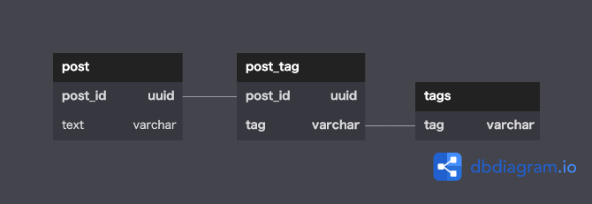

## データベース設計のアンチパターンを学ぶ1

### 課題1

『SQLアンチパターン』の「1章 ジェイウォーク(信号無視)」で挙げられている問題点
- 特定のタグが付けられた投稿の検索
  - 検索条件にパターンマッチが必要
    - 記述によっては意図しない結果が返却される可能性がある
    - インデックスが効かない(使い方によっては効く？)
    - パターンマッチ構文はDBベンダーによって異なる
- 特定の投稿に関連するタグの情報の取得
  - 結合条件にパターンマッチが必要
- tags列に対して集約関数を使いたい
  - 使えない
  - クエリの工夫で集約を行えることがあるが大抵複雑
- 特定の投稿に関連するタグの更新
  - タグのリストを取得し、更新用の文字列を作成し、その文字列で更新するため、コードが長くなる
  - タグのソート順が維持できない場合がある
- タグの妥当性の検証 
  - タグがユーザーの入力値による場合、tags列には様々な値が入る
- 区切り文字の選択
  - タグがユーザーの入力値による場合、入力値に区切り文字が含まれない保証がない
- タグの長さの制限

『SQLアンチパターン』で挙げられていない問題点
- 「１つのセルに１つの値」という第一正規形の原則が満たされていない
- タグが無い場合、空のカラムが存在することになる

### 課題2

タグをtagテーブルに切り出し、  
postテーブルとの間に交差テーブルを設置した。

### 課題3
あるエンティティに対して、ある属性の値が複数付与されるケースで発生しやすいと考えられる。  
特に、初めは値が１つしか付与されない想定だったが、追加要件により複数付与されることになった場合など。  
例
- 製品に対するバグ
- ECサイト上でのお客さんの住所
- 担当従業員と店舗
  - 「店舗に属する従業員」という視点であれば問題ないが、
  「従業員は１店舗に属する」という視点の場合はこのアンチパターンが発生しそう。
  従業員テーブル.担当店舗カラムのイメージ。実際に従業員が複数店舗に属することはあり得る。
