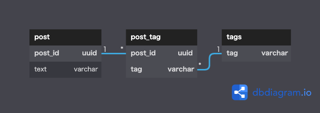

## データベース設計のアンチパターンを学ぶ２

### 課題1

- 『SQLアンチパターン』の「7章 マルチカラムアトリビュート(複数列属性)」で挙げられている問題点
  - 特定のタグを検索するクエリで、各タグ列を検索条件に加える必要がある
    - IN句を使えばコンパクトになる
  - タグを追加するための更新処理の前に、更新可能なタグ列(NULLのタグ列)を検索する必要がある
    - 検索から更新の間に別の誰かが同様の操作をすると競合やエラーが起きてしまう
      - この問題を解消するには面倒な処理が必要な上に、DBベンダーによってはうまくいかない
  - タグ列に同じ値が入る可能性がある
  - タグ列が不足した場合、テーブル定義を変更して列を追加する必要がある
    - 定義変更のためには、テーブル全体のロックが必要になる可能性がある
    - DBベンダーによっては、一旦データのコピーを作成してから新規テーブルにデータを移動する必要がある
    - postテーブルを扱うSQLの調査・修正が必要

### 課題2

「データベース設計のアンチパターンを学ぶ1」と同様に  
タグをtagテーブルに切り出し、
postテーブルとの間に従属テーブルを設置した。

### 課題3
「データベース設計のアンチパターンを学ぶ1」と同様に  
あるエンティティに対して、属性の値が複数同時に付与されるケースで発生しやすいと考えられる。  
特に、初めは値が１つしか付与されない想定だったが、追加要件により複数付与されることになった場合など。 
例
- 製品に対するバグ
- ECサイト上でのお客さんと住所
  - amazonは複数住所に対応しているが、対応していないサイトも多そう。
- 担当従業員と店舗
  - 「店舗に属する従業員」という視点であれば問題ないが、
  「従業員は１店舗に属する」という視点の場合はこのアンチパターンが発生しそう。
  従業員テーブル.担当店舗カラムのイメージ。実際に従業員が複数店舗に属することはあり得る。
