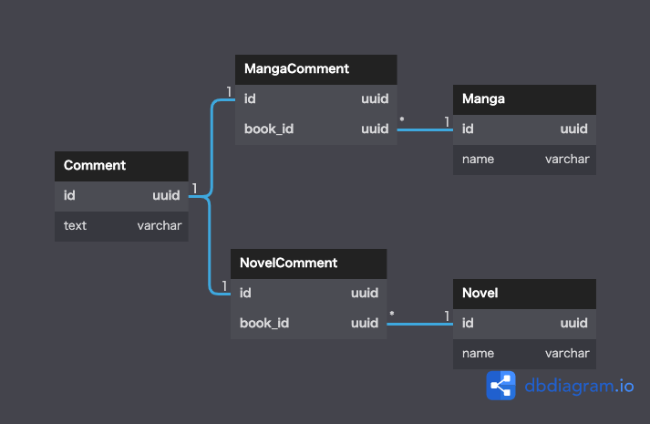
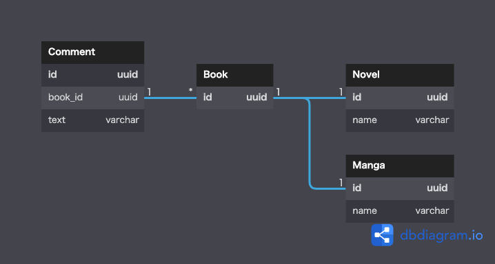

## データベース設計のアンチパターンを学ぶ3

### 課題1

『SQLアンチパターン』の「6章 ポリモーフィック関連」で挙げられている問題点
- データにメタデータが混入している
- 外部キーは１つのテーブルしか対象にできないため、Comment . belongs_to_idの参照整合制約が定義できない
  - Comment . issue_typeに入る文字列の制約や親テーブルが存在することの保証がない
  - カスケード処理が使えない
- コメントの付いているMangaまたはNovelを取得する際は、両方のテーブルをCommentテーブルに外部結合する必要がある
  - 結合条件に一致しなかった方のレコードから取得した列がNullになる
- 親テーブルごとにコメントの扱いが変わると、Commentテーブル定義の変更が必要になる
  - 片方の親テーブルにおいて、不要なカラムが追加される可能性がある
  - 片方の親テーブルにおいて、カラムの制約が満たせない可能性がある

### 課題2
パターン１  
親テーブルごとにCommentテーブルとの交差テーブルを作成し、  
親テーブルから交差テーブルへ、交差テーブルからCommentテーブルへ外部キーを設定した

パターン2   
親テーブルの共通親テーブルを作成し、  
共通親テーブルに対して外部キーを設定した

### 課題3
親テーブルに複数の種類が存在する場合にアンチパターンが発生が可能性が考えられる。  
例えば、店舗と販売商品の管理システムで、カテゴリごとに店舗テーブルを作成しており、  
商品テーブルに販売店舗のカラムを持つケースなど。
