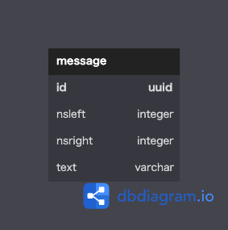
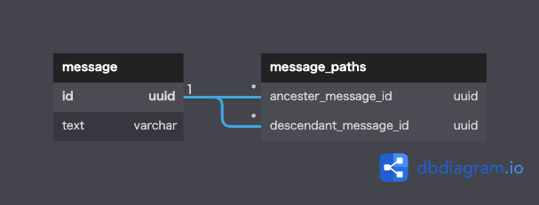

# データベース設計のアンチパターンを学ぶ4

 

## 課題1

『SQLアンチパターン』の「２章 ナイーブツリー(素朴な木)」で挙げられている問題点
- クエリが複雑になる
  - 取得する階層が１つ深くなるほど、joinが１つ増える
  - 階層構造をjoinで１行にして取得するため、集約関数の扱いが難しい
    - アプリケーション上で集約しなければならない
  - サブツリーの削除が面倒
    - 最下層のノードを検索し、そのノードから順に削除する必要がある
    - ON DELETE CASCADEで自動化できる
  - サブツリーの更新がとても面倒
    - 削除と同様の操作が必要
    - 自動化できない

   

## 課題2

### 経路列挙パターン  
pathに自身の階層を格納する。  
例) id1のメッセージにid2のメッセージが連なり、id2のメッセージにid3のメッセージが連なる場合  
id3のpathは「1/2/3/」となる

- 全ての先祖や子孫の取得が簡単
- データの追加が簡単
- ソートが簡単
- 「ジェイウォーク」と同様の弱点がある  

  

### 入れ子集合パターン   
自分の子孫の範囲を各ノードが保持する方法。  
具体的には、自身より下階層にある全てのノードよりも小さい値と、大きい値を格納する。  
- ノードを削除しても親子関係が崩れない
- 直近の親の取得が難しい
- ノードの挿入や移動が難しい
- サブツリーの取得が簡単

  

### 閉包テーブルパターン   
閉包テーブルに自分自身を含めた全ての親子関係を格納する。
- 最もエレガント
- 全ての先祖と子孫の取得が簡単
- 削除も難しくない
- メンテナンスが簡単
- 直近の親子関係の取得がやや難しい
  - path_lengthを持たせることで改善できる

 

## 課題3
同じエンティティ内で親子関係を持つ場合にアンチパターンに陥る可能性が高い。  
- 店舗管理システムで、店舗間の親子関係を表現するケース
- 社員管理システムで、社員間の上司や部下を表現するケース
- ドキュメント管理システムで、ディレクトリ等によって階層構造を持つケース
- 商品管理システムで、セットメニューなどが単品メニューと同じテーブルで管理され、  
 かつセットメニューが単品メニューから構成されるケース
