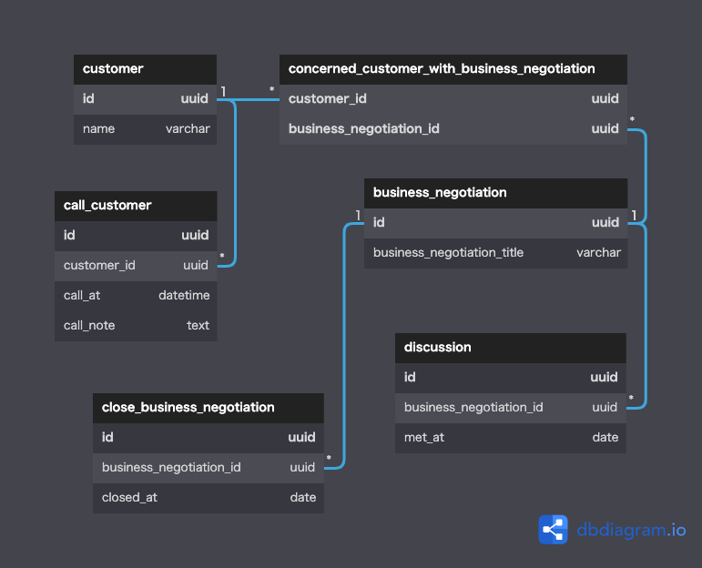

# データベース設計のアンチパターンを学ぶ5

 

## 課題1

### ヒントケース
- 商談の数が増えたら
- 面談を3回実施して、1回目の面談日時を知りたい時
- 一度成約した後に解約し、後にまた同じ人が成約したら

１レコードで管理できるのが１人の顧客に対する１つの商談のみであるため、いずれの場合も以下のような対処が予想される。  
- 同じ顧客のレコードが違うIDで複数作成される
- 既に登録されているレコードのカラム内にカンマ区切りなどで複数の値を登録する(=ジェイウォーク)
- テーブルに「商談2_callNote」「商談3_callNote」のようなカラムが追加される(=マルチカラムアトリビュート)  

その結果として、以下の問題が発生し得る
- 顧客を一意に特定できなくなる
- アンチパターンに陥り、クエリが複雑化したり参照整合性の保証が無いデータが増える

### その他のケース
- １つの商談に複数の顧客が関わるケースを表現できない
- 面談をした時の内容のメモを管理できない

 

## 課題2

### call_customer
- 顧客との電話履歴を管理する。
- １人の顧客には何度も電話をするケースを想定している。  

### concerned_customer_with_business_negotiation
- 商談と顧客の関係を管理する。
- １人の顧客が複数の商談をするケースと、１つの商談に複数人の顧客が関わるケースを想定して、多対多としている。  

### business_negotiation
- 商談を管理する。

### discussion
- 面談を管理する。面談は商談に紐づくものと想定したため、商談テーブルに外部キーを持たせている。
- １つの面談が複数の商談に関わる場合は商談数分レコードを作成する。

 

## 課題3
NewCustomerの定義は以下の特徴があると考える。
- 第一正規化までしか行われていない。  
- 顧客というリソースと、電話・商談・面談といったイベントが１テーブルで管理されている。  
よって、特定のリソースに対して複数のイベントが発生し得るが、  
各イベントが持つ情報量が少ないシステムの開発で起こりうるアンチパターンだと考えられる。  
例えば
- 会計管理システムで、注文テーブルを作る際に、注文、入金、配送などのイベントを全て注文テーブルに格納してしまうケース
