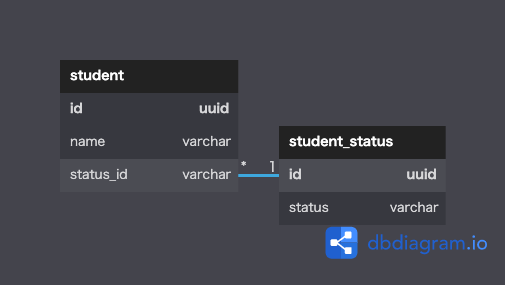

# データベース設計のアンチパターンを学ぶ6

 

## 課題1
『SQLアンチパターン』の10章「サーティワンフレーバー」で挙げられている問題点
- CHECK制約の定義リスト一覧の取得が面倒
  - システムビューのクエリは複雑化しがち
  - 取得できるリストは１つの文字列であるため、アプリケーションコード上で抽出が必要
  - アプリケーションコード上で定義リストが宣言されがち。その場合、CEHCK制約と同期させ続ける必要がある
- 定義条件を変更する際は列を再定義する必要がある
  - DBによってはテーブルの内容のダンプが必要
  - そもそもメタデータは頻繁に更新すべきではない
  - するのであればテストと品質保証もしなければいけない
  - 定義条件は割と頻繁に起こることが予想される
- 既に参照されている制約を削除する場合は、参照行に適当な値を入れる必要がある
- CHECK制約はDB製品間で仕様が統一されていないため、移植が難しい

 

## 課題2
statusを別のテーブルに切り出し、studentテーブルから参照する形。  
書籍ではvarcharのstatusそのものを参照していたが、主キーを参照するようにした。

 

## 課題3
状態の管理が多い際にアンチパターンに陥ると考えられる。
- 会計管理システムの伝票テーブルが「未会計・会計中・会計済み・赤伝票・黒伝票」などの状態を持つケース
- 会員管理システムで、会員テーブルが「申請中・入会・休会・退会」などの状態をもつケース