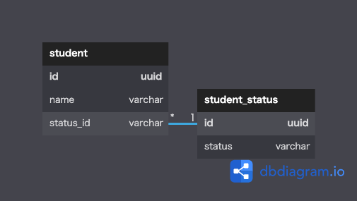

# データベース設計のアンチパターンを学ぶ7

 

## 課題1
[とりあえず削除フラグ](https://www.slideshare.net/t_wada/sql-antipatterns-digest?next_slideshow=19520294)には以下のデメリットが記載されていた。
- 常にwhere句で削除フラグの指定が必要
- 削除フラグの意味がアプリケーション上での有効/無効を示すものなのか、  
 物理削除しても構わないが念の為残しておくことを示すのか、など認識の齟齬が発生する

taikaiFlgの問題点として以下が考えられる。
- 「入会中」「退会済み」の他に「入会申請中」「休会中」などが必要になった場合に対応できない

 

## 課題2
データベース設計のアンチパターンを学ぶ6と同じ設計

 

## 課題3
### 【ECサイトでの注文】
- 物理削除にしたが、指示者の意図では会計状態に「会計取消」というステータスを追加することだった
- 外部制約が使われていない環境の場合、伝票明細などが削除されず、孤立データが生まれる可能性がある
- 注文の取り消しというイベントに関する分析ができない
  - 操作ミスなのか、買った直後にレコメンドされた商品の方が求める商品だったのかなどのユーザの分析

### 【学習塾の進捗管理サービス】  
- 退会して再度入会した生徒の進捗に関して、リカバリが難しい
- 退会というイベントに関する分析ができない