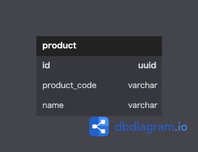

# データベース設計のアンチパターンを学ぶ8

 

## 課題1
- 製造を終了した商品の商品コードを使い回すような業務フローの場合に対応できない
- 商品コードの形式が変更された場合に、商品コードを参照しているテーブルも含めて更新が必要
- 商品コードが発番されていないが、DBに登録したい商品がある場合、登録できない

 

## 課題2
主キーにサロゲートキーを使用  

 

## 課題3
現実に実体として存在するもののエンティティを作成する際に、このアンチパターンの発生が考えられる。  
特に、現時点では一意として発番されているコードが存在するものについては発生の可能性が高いと思われる。  
- 書籍のISBN番号を主キーとするケース
- 商品のSKUコードやJANコード
- 会社名(昔は一意だったが今は同じ社名を使用してもOKになったらしい。)