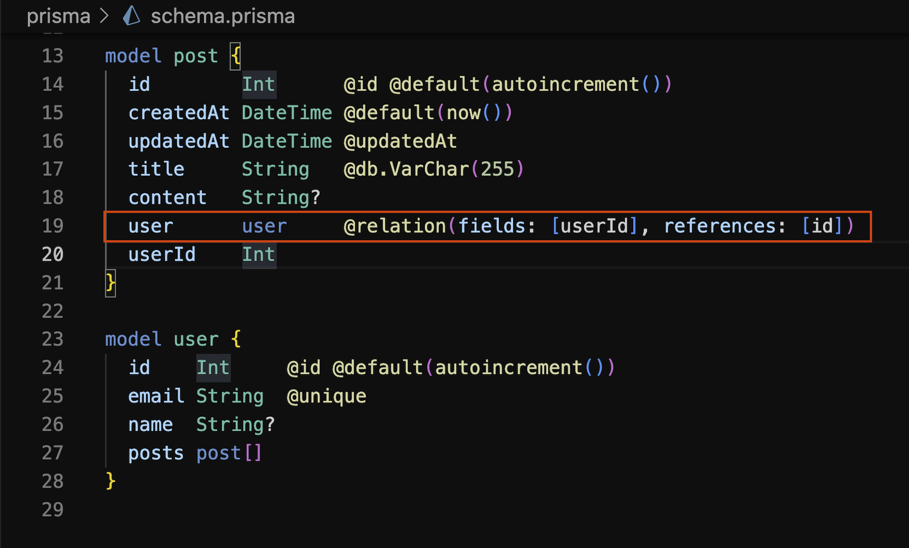
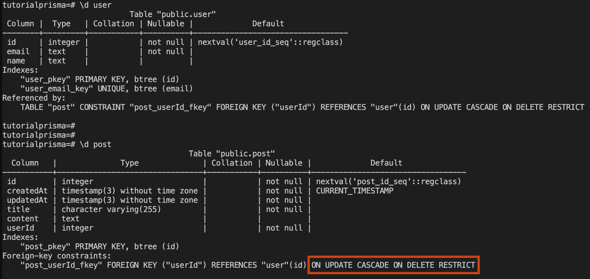
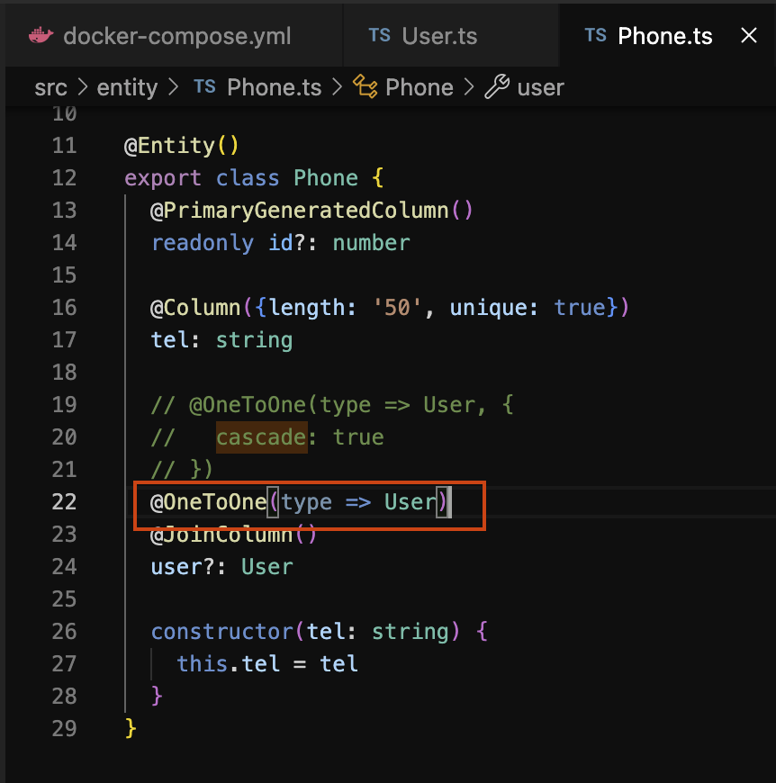
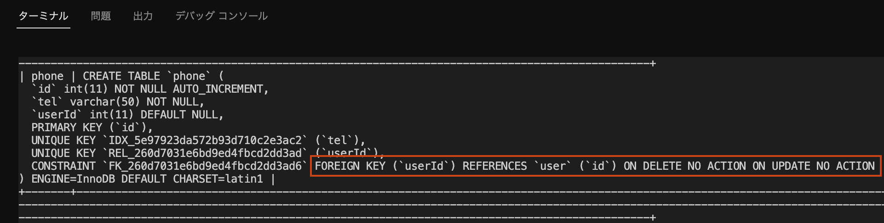

# 外部キー制約について考える

 

## 課題１
### 外部キー制約を一切定義しない場合の問題
- authorテーブルに存在しないauthor_idをbookテーブルに登録できてしまう
  - `inner join` の場合、authorと紐づかないbookレコードは取得されない
  - authorにbookを`left outer join` する場合、bookレコードが取得されない
  - bookにauthorを`left outer join`する場合、authorの情報は`null`になる
- 子を持つauthorレコードの削除と更新ができてしまう -> 上記のパターンが発生する

### 外部キーを定義した場合の問題
- authorテーブルに存在するauthor_idしかbookテーブルに登録できない
- authorレコードを削除・更新する場合、参照している子テーブルから削除しなければいけない
  - テストデータを用意するために少し手間がかかる
  - リストア時に外部制約をオフにする必要がある
  - データベースによっては子テーブルの更新時に親テーブルに共有ロックがかかり、デッドロックの原因になる

 

## 課題２

### MySQLの外部参照アクションについて
#### RESTRICT（参照されている親レコードの値を更新・削除するとエラーになる）
- 参照整合性が保証される。一般的な外部制約
- 参照されている親テーブルを操作する際は参照関係の末端から順に処理する必要がある
- 整合性に違反するアプリケーションロジックに気づくことができる
- 選択すべきケース
  - `ON DELETE`では基本的に`RESTRICT`を採用すべきと考える
  - `ON UPDATE`でも基本的に`RESTRICT`を採用すべきと考えるが、利便性に応じて`CASCADE`を使用してもいいと考える

#### CASCADE(参照されている親レコードを更新・削除すると、子レコードも追従して更新・削除される)
- 参照整合性が保証されるが、アプリケーションコードから操作対象のデータを判断できないため、気を付けないと意図しない更新・削除を行なってしまう
  - 複数の子を持つ親テーブルに対して`ON DELETE`の使用は特に注意が必要
- アプリケーション側の実装コストが低い
- 選択すべきケース
  - `ON DELETE`については、親レコードと子レコードが関係が強く、常に同時に存在することが保証されているような場合は使用して良いと思う
    - 会計伝票と会計伝票詳細
    - ユーザとユーザ詳細
  - `ON UPDATE`については、親レコードと子レコードの関係が強く、常に親に紐づく場合は使用していいと思う
    - 例えばUserテーブルなど、他の多くのテーブルから参照される場合は、`RESTRICT`だと更新処理が大変になる
      - 関係が多い分、トランザクションが大きくなりそうではある
    - 親レコードの値が変更されたら子レコードでもその変更に追従することは、データの流れとしては自然であるため、コード管理をする重要度は高くないように思う
    - `ON UPDATE`でCASCADEを使用して、困るケースが特に浮かばない
    - というか、そもそも外部キーが主キーを参照しているなら、`CASCADE`が有効なのはどんなケース？

#### SET NULL（参照されている親レコードを更新・削除すると、子レコードの参照値がNULLになる）
- 参照整合性が保証されない
- アプリケーション側の実装コストは低くなるが、アプリケーションコードから操作対象のデータを判断できない
- 迷子のレコードが発生するため、バッチ処理などで対応が必要
- 選択すべきケース
  - 親レコードが存在しない場合でも子レコードが存在するケース(弱い整合性)
    - 部署に所属する社員が部署異動などで一時的に所属部署が存在しない場合の部署と社員
    - slackなど、退会したアカウントのメッセージを閲覧できる場合のアカウントとメッセージ

#### NO ACTION(RESTRICTと同じ)

 

### 従業員管理サービスに潜む問題
部署が廃止されてDepartmentレコードが物理削除された場合、
その部署に所属する従業員のEmployeeレコードも物理削除される。

 

### プロジェクトマネジメントツールに潜む問題
担当者が退職してAssigneeレコードが物理削除された場合、担当課題のassignee_idにNULLが入る。
担当者がNULLになった課題の詳細表示ページから担当者情報に遷移する場合など、対処が必要と思われる。

 

### ORMごとのデフォルトの参照アクションについて

 

### Prismaの場合
更新：`CASCADE`
削除：`RESTRICT`
更新が`CASCADE`なのは利便性を優先したためで、
削除が`RESTRICT`なのは、安全性を考慮すると妥当だと考えられる。

 

Prismaのスキーマ設定

 

DB上でのテーブル定義の確認

 

### TypeORMの場合
更新：`NO ACTION`
削除：`NO ACTION`
更新が`NO ACTION`なのは、`cascade`オプションを設定すると、
TypeORMで関連データの制約を守りながら更新・削除処理を行えるため、
DB側で`CASCADE`を設定する必要がないためと考えられる。
削除が`RESTRICT`なのは、Prisma同様に安全性を考慮したためと考えられる。

 

TypeORMのスキーマ設定

 

DB上でのテーブル定義の確認

 

### RESTRICTとNO ACTIONの違い
MySQLでは`RESTRICT`と`NO ACTION`は全く同じだが、
PostgresSQLでは`NO ACTION`を指定すると外部制約を遅延チェックにすることができる。
遅延チェックであれば、外部制約を持つカラムの登録更新処理において、
トランザクション内で参照整合性を満たすのなら外部制約違反にならない。
`RESTRICT`では参照関係の末端から処理をしないと違反になる。

 

### 外部制約に関するクイズ
#### Q1. MySQLのストレージエンジンにはMyIsamとInnoDBがある。このうち外部制約を付けても効果がないのはどちらか
#### Q2. MySQLとPostgreSQLには、親レコードを持つ子レコードの外部キーの登録・更新・削除時のロックの取り方に違いがある。この違いとは何か
#### Q3. Q2のロックの取り方の違いによってMySQLではデッドロックが起きやすい。この問題を防ぐ方法としては何が考えられるか

 

## 参考記事
- [外部キー制約が一切ないと何に困るのか？](https://zenn.dev/dowanna6/articles/2667cbb1ab7233)
- [PostgreSQLの制約検査を遅延させるとリストア時間が早くなるか検証してみた](https://dev.classmethod.jp/articles/postgresql-restore-to-deferred-fk-check-table/)
- [外部キー制約の設定と動作確認](https://www.wakuwakubank.com/posts/405-mysql-foreign-key/)
- [MySQLにて外部キーが貼れない。エラーは出ていない（MySQLのストレージエンジン・InnoDBとMyISAMの違い）](https://karoten512.hatenablog.com/entry/2017/11/07/232534)
- [1.7.2.3 FOREIGN KEY 制約の違い](https://dev.mysql.com/doc/refman/8.0/ja/ansi-diff-foreign-keys.html)
- [MySQLの外部キー制約RESTRICT,CASCADE,SET NULL,NO ACTIONの違いは？](https://qiita.com/suin/items/21fe6c5a78c1505b19cb)
- [外部キー制約について](https://qiita.com/SLEAZOIDS/items/d6fb9c2d131c3fdd1387)
- [【MySQL】外部キー制約の親レコードの更新時、削除時に起こるアクションの定め方と設定基準](https://cpoint-lab.co.jp/article/202012/18021/)
- [ORMとはなんぞや](https://utouto97.hatenablog.com/entry/2021/07/21/224759)
- [Prisma: Node.js & TypeScript向けの完璧なORM](https://zenn.dev/kanasugi/articles/a082bd39c5bdf2)
- [TypeScriptでORMのPrismaに入門した](https://qiita.com/dkawabata/items/cafa3dc53921db520360)
- [Docker + VS Code Remote-Containersを使ったPrismaハンズオン](https://bgtu-techblog.com/2022/03/27/docker-vs-code-remote-containers%E3%82%92%E4%BD%BF%E3%81%A3%E3%81%9Fprisma%E3%83%8F%E3%83%B3%E3%82%BA%E3%82%AA%E3%83%B3/)
- [PostgreSQLでテーブルを作成する際に指定できないテーブル名について](https://qiita.com/MasaKu_n/items/f68960e2ebf51673d954)
- [prismaのschemaファイルの書き方（MySQL用）](https://seri.hatenablog.com/entry/2021/07/27/123755)
- [【入門】CLIでプロジェクト構築して使い方を確認](https://www.wakuwakubank.com/posts/725-typeorm-cli-init/)
- [【NestJS】TODOリストでCRUDの処理を実装](https://zenn.dev/chida/articles/bba2b5346414ed)
- [TypeORMのcascade, orphanedRowAction等RelationOptionsの違い](https://uyamazak.hatenablog.com/entry/2021/10/06/140909)
- [TypeORM cascade option: cascade, onDelete, onUpdate](https://stackoverflow.com/questions/55098023/typeorm-cascade-option-cascade-ondelete-onupdate)
- [RDBMS with Node.js](https://www.slideshare.net/bitbankink/rdbms-with-nodejs-111247034)
- [TypeORMでエンティティを定義する際のガイドライン](https://tech.bitbank.cc/typeorm-entity-guideline/)
- [13.1.20.5 FOREIGN KEY の制約](https://docs.oracle.com/cd/E17952_01/mysql-8.0-ja/create-table-foreign-keys.html)
- [データベース PostgreSQL 制約](https://s-kita.hatenablog.com/entry/20081013/1223863631)
- [1.7.2.3 FOREIGN KEY 制約の違い](https://docs.oracle.com/cd/E17952_01/mysql-8.0-ja/ansi-diff-foreign-keys.html)
- [MySQL 外部キー制約のデッドロック](https://www.yuulinux.tokyo/10592/)
- [外部キーに「ON UPDATE CASCADE ON DELETE CASCADE」を使用することは良いことですか、悪いことですか？なぜこのメカニズムが存在するのですか？](https://www.web-dev-qa-db-ja.com/ja/postgresql/%E5%A4%96%E9%83%A8%E3%82%AD%E3%83%BC%E3%81%AB%E3%80%8Con-update-cascade-on-delete-cascade%E3%80%8D%E3%82%92%E4%BD%BF%E7%94%A8%E3%81%99%E3%82%8B%E3%81%93%E3%81%A8%E3%81%AF%E8%89%AF%E3%81%84%E3%81%93%E3%81%A8%E3%81%A7%E3%81%99%E3%81%8B%E3%80%81%E6%82%AA%E3%81%84%E3%81%93%E3%81%A8%E3%81%A7%E3%81%99%E3%81%8B%EF%BC%9F%E3%81%AA%E3%81%9C%E3%81%93%E3%81%AE%E3%83%A1%E3%82%AB%E3%83%8B%E3%82%BA%E3%83%A0%E3%81%8C%E5%AD%98%E5%9C%A8%E3%81%99%E3%82%8B%E3%81%AE%E3%81%A7%E3%81%99%E3%81%8B%EF%BC%9F/l965954081/)

